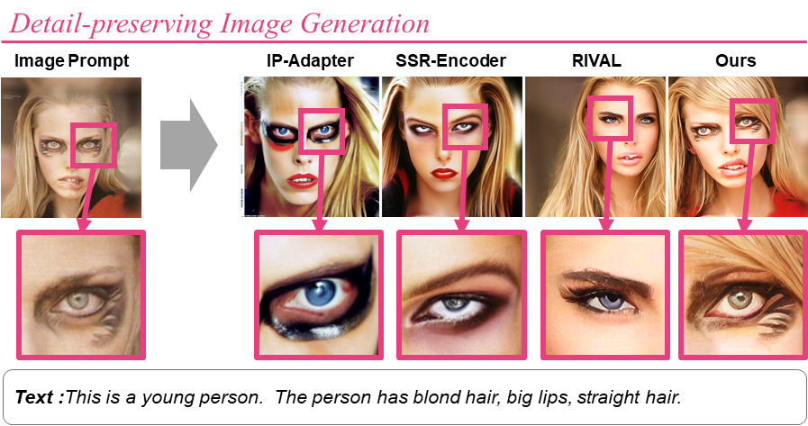
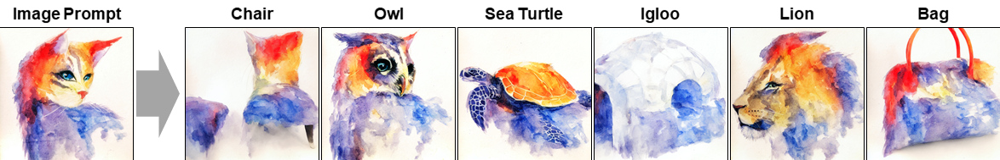

# Devil is in the Detail: Towards Injecting Fine Details of Image Prompt in Image Generation via Conflict-free Guidance and Stratified Attention (CVPR 2025)

[](https://openaccess.thecvf.com/content/CVPR2025/papers/Jo_Devil_is_in_the_Detail_Towards_Injecting_Fine_Details_of_CVPR_2025_paper.pdf), [](https://openaccess.thecvf.com/content/CVPR2025/supplemental/Jo_Devil_is_in_CVPR_2025_supplemental.pdf)




---

## Setup

Our codebase is built on [diffusers](https://github.com/huggingface/diffusers)
and has shared dependencies and model architecture.

### Creating a Conda Environment

```
conda env create -f environment.yaml
conda activate Indetail-IP
```

### Downloading StableDiffusion Weights
Our code automatically downloads the Stable Diffusion model weights from HuggingFace to the `cache_dir` (as specified in each task’s YAML file), based on the settings defined in `configs/default_settings.yaml`.

If the automatic download does not work (e.g., due to authentication or network issues), you can manually download the model from the HuggingFace repository and set the `cache_dir` path in the config file to the downloaded location.

In our paper, we used the weights from [runwayml/stable-diffusion-v1-5](https://huggingface.co/stable-diffusion-v1-5/stable-diffusion-v1-5).  
However, since these weights have been deprecated, the released code is configured to use the weights from [stabilityai/stable-diffusion-v1-5](https://huggingface.co/stable-diffusion-v1-5/stable-diffusion-v1-5), referred to as `sd15new` in `configs/default_settings.yaml`.

---

## Running Our Model in Three Tasks

As described in our paper, our model supports the following three tasks:

1. **Image Variation**
2. **Structure-Guided Image Generation**
3. **Cross-Prompt Image Generation**

<p align="center">
  
</p>

---

### 🔧 Step 1: Set Configuration

Each task has its own YAML configuration file:

- `configs/image_variation.yaml` — for **Image Variation**
- `configs/stguided_imggen.yaml` — for **Structure-Guided Image Generation**
- `configs/crossprompt.yaml` — for **Cross-Prompt Image Generation**

You can control the core components of our proposed method through the YAML configuration:

- **Conflict-Free Guidance**  
  To enable this guidance method, set `ap_kwargs.sain` to `"cond"`.

- **Stratified Attention**  
  To enable attention stratification, set `ap_kwargs.lambda_img` to a value greater than 0.  
  (Higher values increase alignment with the image prompt.)


---

### 🚀 Step 2: Run the Model

Once the configurations are set, run the model with the following commands:

```bash
python run.py --c configs/image_variation.yaml
python run.py --c configs/stguided_imggen.yaml
python run.py --c configs/crossprompt.yaml
```
---
### 📊 Example Outputs

Here are example results for each task using the default configurations:

**Image Variation**  


**Structure-Guided Image Generation**  


**Cross-Prompt Image Generation**  



---
## Acknowledgements

This implementation uses code from the following repositories:

- [Official RIVAL implementation](https://github.com/dvlab-research/RIVAL)
- [Official StyleAligned implementation](https://github.com/google/style-aligned/)
- The portion of README structure was adapted from the [Plug-and-Play](https://github.com/MichalGeyer/plug-and-play) repository.

We thank the original authors for open-sourcing their code.

---

## Citation
```
@inproceedings{jo2025devil,
  title={Devil is in the Detail: Towards Injecting Fine Details of Image Prompt in Image Generation via Conflict-free Guidance and Stratified Attention},
  author={Jo, Kyungmin and Yun, Jooyeol and Choo, Jaegul},
  booktitle={Proceedings of the Computer Vision and Pattern Recognition Conference},
  pages={23595--23603},
  year={2025}
}
```